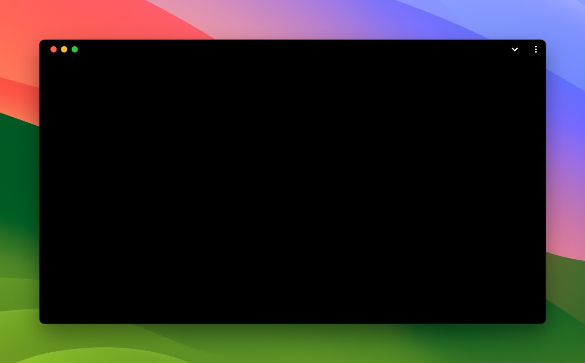

# BlackPWA

Is this the simplest PWA (Progressive Web App) ever? It's just a black browser tab / window / screen, but its simplicity offers diverse potential uses, from enhancing focus to serving as a privacy screen. Despite its minimalist appearance, BlackPWA's utility can extend beyond initial expectations.

| The BlackPWA window on macOS | BlackPWA in full screen mode on macOS |
| :---: | :---: |
|  |  |

## Potential Uses

- **Distraction-Free Writing:** Minimal visual clutter for focused writing or brainstorming.
- **Eye Rest:** Provide a simple black screen to rest your eyes during breaks.
- **Focus Tool:** Helps cover distractions, allowing for better concentration on primary tasks.
- **Presentation Background:** Neutral background for presentations or video calls.
- **Privacy Screen:** Quickly hide parts of the desktop or the entire desktop to maintain privacy.
- **PWA Testing:** Check if your browser and device can install and display Progressive Web Apps properly.
- **Screen Management:** Hide screens, save power, and prevent burn-in without turning screens off.

## Benefits

- **Movable and Resizable:** Can be moved and resized like any other window.
- **Full Screen Capability:** Can go full screen.
- **Simple Installation:** Easily installed directly from the browser.
- **Small Disk Space:** Occupies a small amount of disk space (around 1.4 MB).

## Support Us

BlackPWA is free, and we love creating and sharing projects like this with the community. If you find BlackPWA useful and want to support Tecdrop, consider purchasing our [Pitch Black Wallpaper Pro](https://www.tecdrop.com/pitchblackwallpaperpro/) app. Both apps revolve around the simplicity and elegance of the color black, making Pitch Black Wallpaper Pro a natural choice for BlackPWA users.

**Pitch Black Wallpaper Pro:**

- Offers hundreds of pitch black, dark, and AI-generated wallpapers.
- Enhances battery life on OLED screens.
- Reduces eyestrain with soothing dark backgrounds.

Check it out here: [Pitch Black Wallpaper Pro](https://www.tecdrop.com/pitchblackwallpaperpro/).

## License

Because BlackPWA may be the simplest PWA ever, it's only fitting that it uses the MIT License, which may be the simplest license ever. This straightforward and permissive license allows you to use, copy, modify, and distribute the software with ease. For more details, see the [LICENSE](LICENSE) file.
